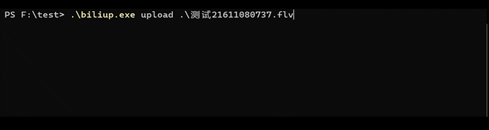

# biliup-rs

[](https://crates.io/crates/biliup)

[](https://t.me/+IkpIABHqy6U0ZTQ5)
[![Discord chat][discord-badge]][discord-url]

[discord-badge]: https://img.shields.io/discord/1015494098481852447.svg?logo=discord
[discord-url]: https://discord.gg/shZmdxDFB7
B 站命令行投稿工具，支持**短信登录**、**账号密码登录**、**扫码登录**、**浏览器登录**以及**网页Cookie登录**，并将登录后返回的 cookie 和 token 保存在 `cookie.json` 中，可用于其他项目。

**文档地址**：<https://biliup.github.io/biliup-rs>

本项目使用 Rust，可以作为 lib 被调用，理论上可以通过 [PyO3](https://github.com/PyO3/pyo3) 作为库提供给 Python 和 [napi-rs](https://github.com/napi-rs/napi-rs) 给 Node.js 等进行调用。

[下载地址](https://github.com/ForgQi/biliup-rs/releases)

## Aspirations

### upload

- [x] bilibili
- [ ] 小红书（work-in-process）

### download

- [x] 斗鱼直播
- [x] 虎牙直播
- [x] B站直播
- [ ] 抖音live (coming soon)
- [ ] 快手live (coming soon)

## USAGE

投稿支持**直接投稿**和对现有稿件**追加投稿**：

- 快速投稿，输入 `biliup upload test1.mp4 test2.mp4` 即可快速多p投稿；
- 通过配置文件投稿，配置文件详见 [config.yaml](examples/config.yaml) ，支持按照 Unix shell style patterns 来批量匹配视频文件，如 `/media/**/*.mp4` 匹配 media 及其子目录中的所有 mp4 文件且可以自由调整视频标题、简介、标签等：

```shell
$ biliup help upload

USAGE:
    biliup.exe upload [OPTIONS] [VIDEO_PATH]...

ARGS:
    <VIDEO_PATH>...    需要上传的视频路径,若指定配置文件投稿不需要此参数

OPTIONS:
    -c, --config <FILE>                Sets a custom config file
        --copyright <COPYRIGHT>        是否转载, 1-自制 2-转载 [default: 1]
        --cover <COVER>                视频封面 [default: ]
        --desc <DESC>                  视频简介 [default: ]
        --dolby <DOLBY>                是否开启杜比音效, 0-关闭 1-开启 [default: 0]
        --hires <LOSSLESS_MUSIC>       是否开启 Hi-Res, 0-关闭 1-开启 [default: 0]
        --dtime <DTIME>                延时发布时间，距离提交大于4小时，格式为10位时间戳
        --dynamic <DYNAMIC>            空间动态 [default: ]
    -h, --help                         Print help information
        --interactive <INTERACTIVE>    [default: 0]
    -l, --line <LINE>                  选择上传线路 [possible values: bda2, ws, qn, kodo, cos, cos-
                                       internal, bldsa]
        --limit <LIMIT>                单视频文件最大并发数 [default: 3]
        --mission-id <MISSION_ID>
        --no-reprint <NO_REPRINT>      自制声明, 0-允许转载，1-禁止转载 [default: 0]
        --open-elec <OPEN_ELEC>        是否开启充电面板, 0-关闭 1-开启 [default: 0]
        --source <SOURCE>              转载来源 [default: ]
        --tag <TAG>                    视频标签，逗号分隔多个tag [default: ]
        --tid <TID>                    投稿分区 [default: 171]
        --title <TITLE>                视频标题 [default: ]
        --up-close-danmu
        --up-close-reply
        --up-selection-reply
```

- 下载视频：`./biliup download https://xxxx`
- 查看转码失败具体分p：`./biliup show BVxxxxx`
- 查看完整用法命令行输入 `biliup -h`

```shell
biliup 0.1.14
Upload video to bilibili.

USAGE:
    biliup.exe [OPTIONS] <SUBCOMMAND>

OPTIONS:
    -h, --help                         Print help information
    -u, --user-cookie <USER_COOKIE>    登录信息文件 [default: cookies.json]
    -V, --version                      Print version information

SUBCOMMANDS:
    append      是否要对某稿件追加视频
    download    下载视频
    dump-flv    输出flv元数据
    help        Print this message or the help of the given subcommand(s)
    login       登录B站并保存登录信息
    renew       手动验证并刷新登录信息
    show        打印视频详情
    upload      上传视频
```

### 多账号支持

请在子命令**之前**通过 `-u` 或者 `--user-cookie` 参数传入 cookie 文件的路径（默认为当前目录下的 "cookies.json"）。例如：

```shell
$biliup -u user1.json login
$biliup --user-cookie user2.json upload ...
$biliup renew  # ./cookies.json
```

### Windows 演示

登录：

```powershell
.\biliup.exe login
```


上传：

```powershell
.\biliup.exe upload
```



## SEE ALSO

- 自动录播投稿[工具](https://github.com/ForgQi/biliup)
- 基于此项目的[GUI版](https://github.com/ForgQi/Caution)

___

bilibili 投稿模式分主要为 fetch 和直传两种，线路概览：

测速：<http://member.bilibili.com/preupload?r=ping>

- bup（直传b站投稿系统，适合**大陆地区**）
  - upos
    - [x] bda2（百度）
    - [x] qn（七牛）
    - [x] ws（网宿）
- bupfetch （传至合作方后由b站投稿系统拉取，适合**港澳台和海外地区**）
  - [x] kodo（七牛）
  - [ ] bos（百度）
  - [ ] gcs（谷歌）
  - [x] cos（腾讯）

B 站在上传前会通过 probe 来返回几条线路，并发包测试从中选择响应时间较短的，但对与国外的机器实际上不太准确，所以建议还是在实际测试后手动选择一条线路，实际测试大部分国外机器在 kodo 线路 3 并发的情况下能达到 60-90 MiB/s 的速度，理论上增加并发数能跑满带宽。

## TIPS

用户等级大于 3 ，且粉丝数 > 1000 ，Web 端投稿不限制分 P 数量。B 站 Web 端将替换为[合集](https://www.bilibili.com/read/cv14762048) 。

对于不满足条件的账号，多 P 投稿只能依靠 B 站的投稿客户端，但是投稿客户端使用的线路与 Web 端不同，质量低于 Web 端的线路，在国外机器会放大这一差距。所以本项目使用 client 的提交接口配合 Web 端的上传线路，弥补两者各自的不足。既可以多 P 上传，又提供了质量（速度和稳定性）较高的线路，且提供了 Web 端不具备的手动切换线路功能。

## For Developers

```shell
export DATABASE_URL="sqlite:data.db"
cargo sqlx db create
cargo sqlx migrate run --source .\crates\biliup\migrations\
cargo sqlx prepare  --merged 
cargo run -- server -b localhost
```
